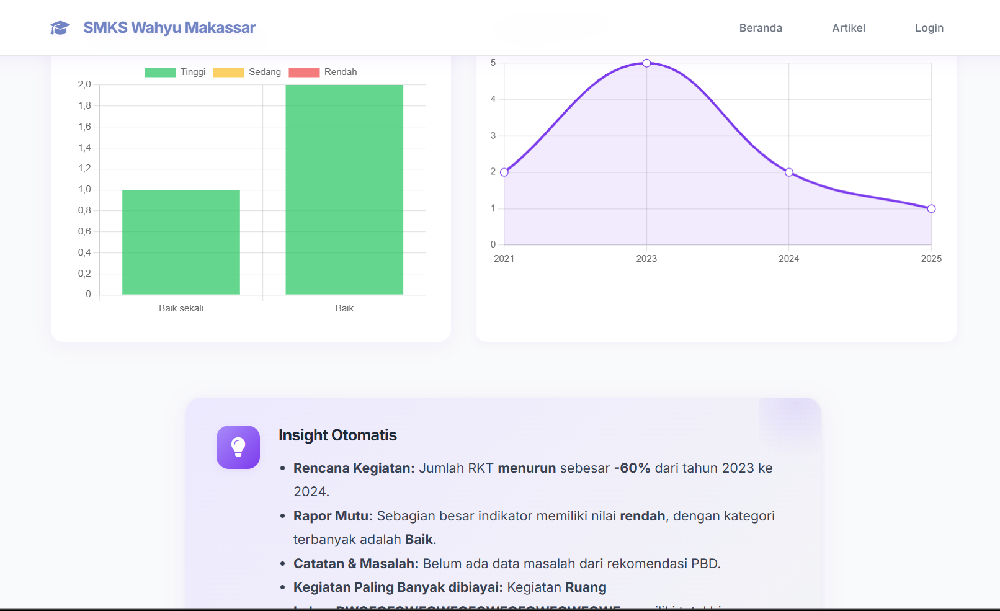

## 🚀 Laravel Project Setup Guide

Selamat datang di **Rapor Mutu Pendidikan**!  
Website ini hadir untuk membantu sekolah memantau dan meningkatkan mutu pendidikan dengan lebih mudah dan cepat. Pantau perkembangan rapor mutu sekolah secara real-time dengan fitur dashboard dan insight otomatis kemudahan pengelolaan data!

---



---

### 🛠️ Cara Instalasi

1. **Clone Repository**
   ```bash
   git clone https://github.com/username/repo-name.git
   cd repo-name
   ```

2. **Install Dependency**
   ```bash
   composer install
   npm install
   npm run dev
   ```

3. **Siapkan Environment**
   ```bash
   cp .env.example .env
   php artisan key:generate
   ```

4. **Buat Storage Link**
   ```bash
   php artisan storage:link
   ```

5. **Konfigurasi Database**
   - Edit file `.env` sesuai database kamu.
   - Jalankan migrasi:
     ```bash
     php artisan migrate
     ```

6. **Jalankan Server Development**
   ```bash
   php artisan serve
   ```

---

### 👑 Akun Super Admin

```super_admin
username: admin@web.com
pass: superpassword
```
Happy Coding 😁

